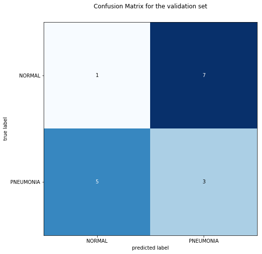

# Pneumonia Image Classifier

The intention is to predict if a given photo represents lungs with pneumonia.

Dataset: https://www.kaggle.com/paultimothymooney/chest-xray-pneumonia

## Model Summary

The final model was trained for about 25 epochs.

Scores for the validation set:
- Loss: 0.44
- Accuracy: 75.0%
- Precision score:  30.0%
- Recall score:  37.5%
- F1 score:  33.33% 

Confusion matrix:

## Model Architecture

The model is based on InceptionV3 model with two fully connected top layers:

* `x = Flatten()(x)`
* `x = Dense(64, activation='relu')(x)`
* `x = Dense(2, activation='softmax')(x)`

Summary:
* Total params: 30,191,586
* Trainable params: 8,388,802
* Non-trainable params: 21,802,784
